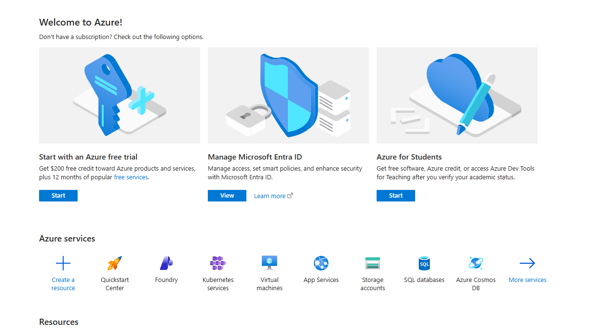
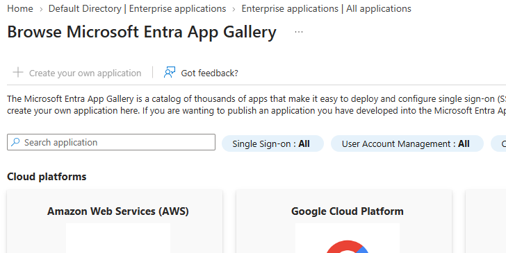
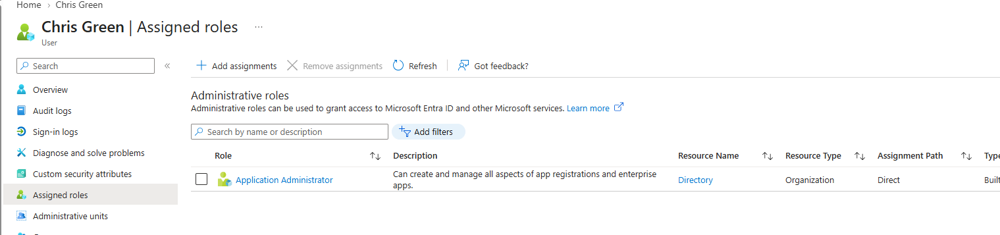
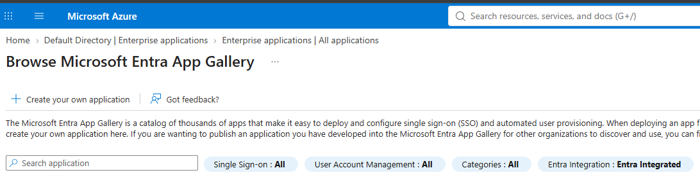

# Lab 01: Microsoft Entra ID User and Role Management

## Overview

In this lab, I practiced identity and access management in Microsoft Entra ID. I created a test user, configured multifactor authentication (MFA), assigned an administrative role, and verified how the assigned permissions changed the user’s access.

## Objectives

- Create a new Microsoft Entra ID user
- Configure Microsoft Authenticator for MFA
- Test access before assigning an administrative role
- Assign the Application Administrator role
- Verify role-based access control
- Apply the principle of least privilege
- Troubleshoot access and permission issues

## Lab Environment

- Microsoft Entra ID Free tenant
- Microsoft Azure portal
- Microsoft Authenticator
- Test user: Chris Green
- Assigned role: Application Administrator

> **Security note:** Passwords, tenant IDs, object IDs, QR codes, and other sensitive information are not included in this repository.

## Lab Steps

### 1. Created a Test User

I created a test user named Chris Green in Microsoft Entra ID. The account was configured as an internal member of the organization.

### 2. Configured Multifactor Authentication

I signed in with the test account and registered Microsoft Authenticator. This provided an additional layer of protection beyond the account password.

### 3. Tested Access Before Role Assignment

Before assigning an administrative role, the **Create your own application** option was disabled. This confirmed that a standard user did not have permission to add enterprise applications.

### 4. Assigned the Application Administrator Role

I assigned the built-in **Application Administrator** role to Chris Green. This role provides application-management capabilities without granting full Global Administrator access.

### 5. Verified Access After Role Assignment

After signing out and signing back in, the **Create your own application** option became available. This verified that the Application Administrator role granted the required application-management permissions.

## Troubleshooting

The newly assigned permission did not appear immediately in the existing user session. I signed out and signed back in to obtain a new authentication token, after which the permission became available.

I also encountered an `AADSTS50011` redirect URI mismatch while testing the Entra admin-center login. I used the Azure portal as an alternative access path and successfully continued the lab.

## Security Concepts Demonstrated

- **Identity management:** Creating and managing a cloud user
- **Authentication:** Verifying the user through a password and MFA
- **Authorization:** Controlling access through an assigned role
- **Role-based access control:** Granting permissions according to job responsibilities
- **Least privilege:** Assigning Application Administrator instead of Global Administrator
- **Troubleshooting:** Refreshing the authentication session after a role change

## Conclusion

This lab helped me understand the difference between authentication and authorization in Microsoft Entra ID. I learned that MFA protects the sign-in process, while role assignments determine what an authenticated user is authorized to do. I also gained practical experience applying least privilege and troubleshooting delayed permission changes.
